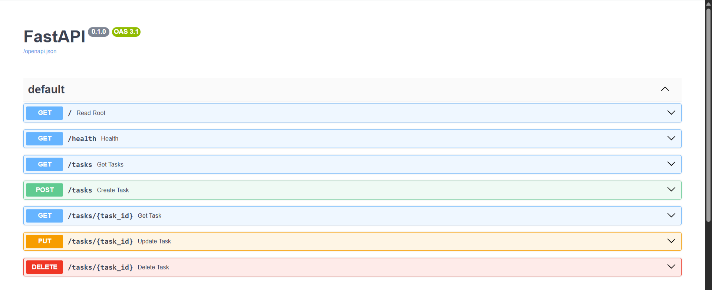

# Task API

A small CRUD API for managing a to-do list, built with FastAPI. Supports creating, reading, updating, and deleting tasks. Data is stored in memory (resets when the server restarts).

Built as Week 2, Assignment A1 of the FlyRank Internship Backend Track.

## Run it

```
python -m venv venv
venv\Scripts\Activate.ps1
python -m pip install fastapi "uvicorn[standard]"
uvicorn main:app --reload
```

Server runs at `http://localhost:8000`.
Interactive docs at `http://localhost:8000/docs`.

## Endpoints

| Method | Path | Description |
|--------|------|-------------|
| GET | `/` | API info |
| GET | `/health` | Health check |
| GET | `/tasks` | List all tasks |
| GET | `/tasks/{task_id}` | Get one task |
| POST | `/tasks` | Create a task |
| PUT | `/tasks/{task_id}` | Update a task's title and/or done status |
| DELETE | `/tasks/{task_id}` | Delete a task |

## Example request

```
PS C:\Users\user\Documents\FlyRank Ai\CRUD API> curl.exe -i http://localhost:8000/tasks/1
HTTP/1.1 200 OK
date: Wed, 15 Jul 2026 19:43:44 GMT
server: uvicorn
content-length: 40
content-type: application/json

{"id":1,"title":"Buy milk","done":false}
```

## Swagger UI



## Notes

Data is in-memory only — restarting the server resets the task list back to the 3 example tasks. A database is planned for Week 3.